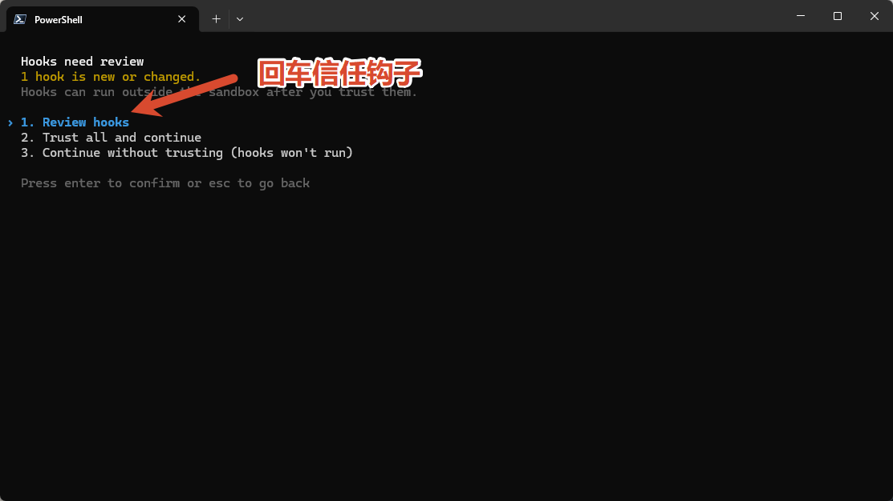
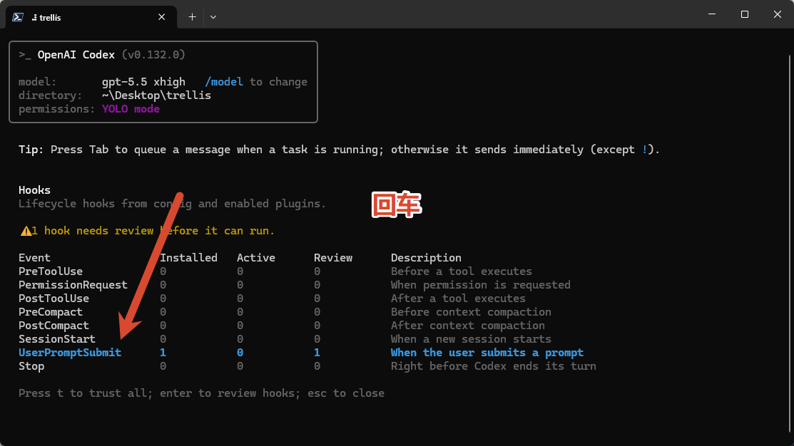
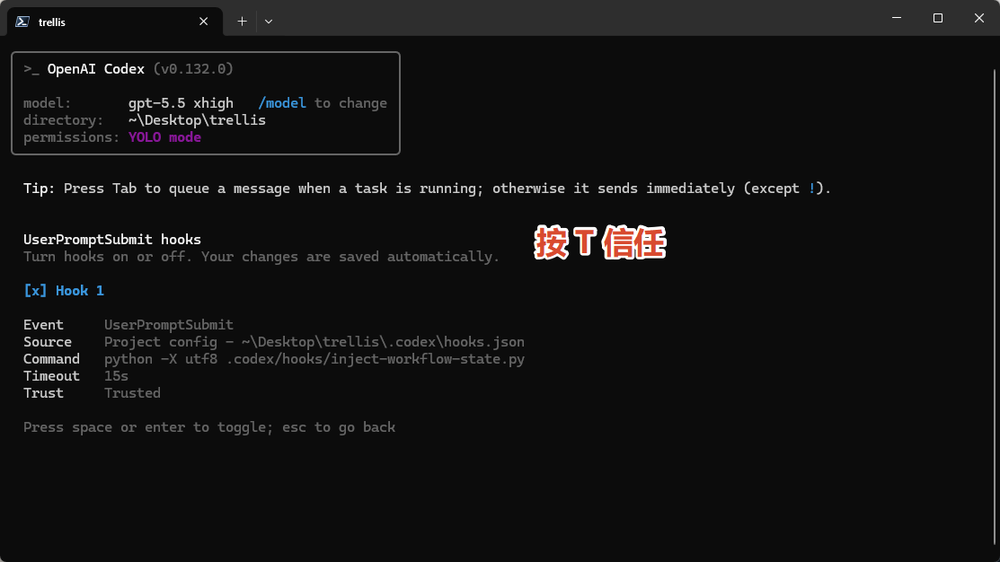

# Trellis MICU 课堂资料

这个仓库主要用于课程学习。第一次打开时，优先阅读根目录里的教学页面HTML先下载后阅读：

[教案.html](./教案.html)

`教案.html` 是完整的上手说明和课堂主线内容。其他目录和文件大多是 Trellis 的源码、配置和参考资料，初学时不用从源码开始看。

## 最新 Hook 信任步骤

如果在使用 Claude Code 或 Codex 接入 Trellis 时遇到需要信任 Hook 的提示，请按下面三张图的顺序操作。它们是当前最新步骤；如果旧教程或口头说明与图片不一致，以这里为准。

### 第一步



### 第二步



### 第三步



## Codex 0.133 超时配置报错

如果 Codex 0.133 启动时出现下面的配置加载错误：

```text
error loading configuration:
  features.multi_agent_v2.default_wait_timeout_ms must be at least
  features.multi_agent_v2.min_wait_timeout_ms
```

这是 Codex 新版本对 `timeout` 做了更严格校验。5 月 16 日安装的 Trellis 旧配置只写了：

```toml
[features.multi_agent_v2]
min_wait_timeout_ms = 480000
```

但没有写 `default_wait_timeout_ms`。Codex 0.130 对这个旧配置比较宽松，所以不会报错；Codex 0.133 会要求 `default_wait_timeout_ms` 必须大于或等于 `min_wait_timeout_ms`，否则直接拒绝加载配置。

修复方式是在用户级 `~/.codex/config.toml` 的同一段里补上 `default_wait_timeout_ms`，例如：

```toml
[features.multi_agent_v2]
min_wait_timeout_ms = 480000
default_wait_timeout_ms = 480000
```

## 文件说明

- `教案.html`：学生主要阅读材料。
- `1.png`、`2.png`、`3.png`：最新的 Hook 信任操作截图。
- `Trellis/`：Trellis 项目源码，供需要深入理解实现的同学参考。
- `.trellis/`、`.claude/`、`.codex/`、`.agents/`：Trellis 和 AI 工具的项目配置，普通学习流程中不需要优先阅读。
